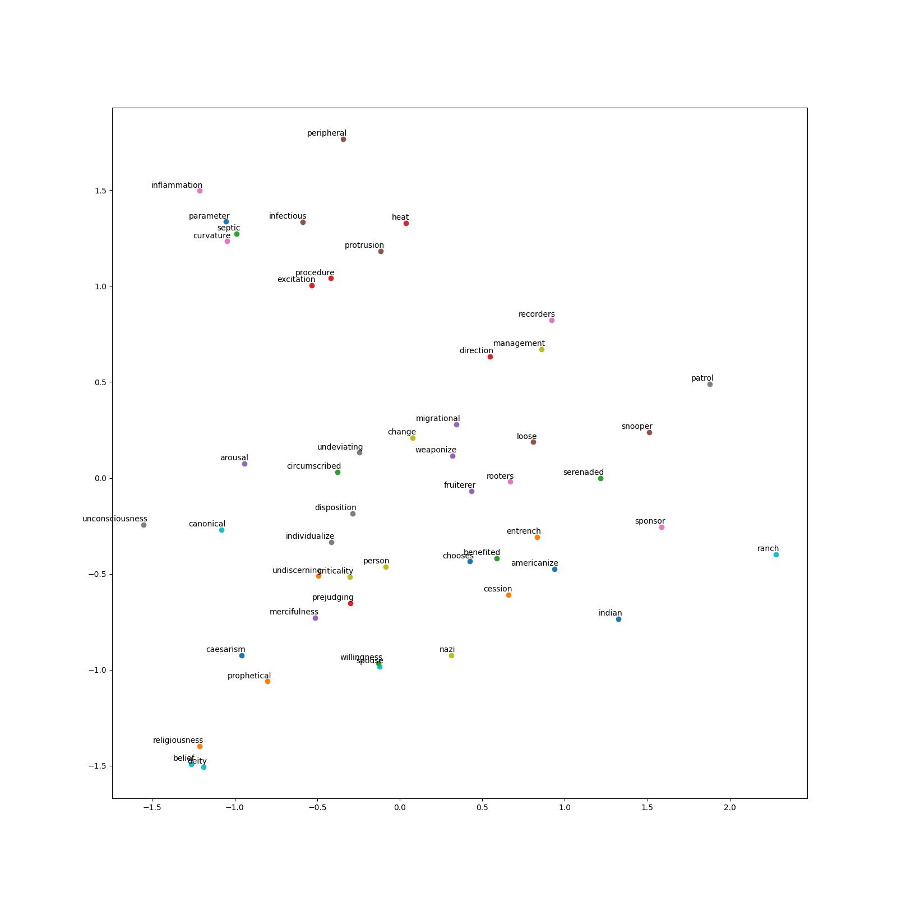

# FastText

- Paper: 
  - https://arxiv.org/pdf/1607.04606.pdf
  - https://arxiv.org/pdf/1607.01759.pdf
  - https://arxiv.org/pdf/1612.03651.pdf
- Code: 
  - https://github.com/facebookresearch/fastText 
- Webpage: 
  - https://fasttext.cc/


# Requirements
 - g++-4.7.2 or newer (C++11 support)
 - make
 - Perl
 - Python (NumPy + SciPy + MatPlotLib + Pandas)


# Installation
```bash
# Inside the /data-science-frameworks/FastText/ folder
$ wget https://github.com/facebookresearch/fastText/archive/v0.9.2.zip
$ unzip v0.9.2.zip
$ rm v0.9.2.zip
$ cd fastText-0.9.2
$ make
$ cd ..
```


# Usage Example
FastText has two main use cases: 
- Word Representation Learning
- Text Classification


## 1. Word Representation Learning:
### Get data: 
You can get example data for word representation learning with the following commands:
```bash
# Inside the /data-science-frameworks/FastText/ folder
$ mkdir -p data
$ mkdir -p result

$ wget -c http://mattmahoney.net/dc/enwik9.zip -P data
$ unzip data/enwik9.zip -d data
$ rm data/enwik9.zip
$ perl wikifil.pl data/enwik9 > data/fil9

$ wget -c https://nlp.stanford.edu/~lmthang/morphoNLM/rw.zip -P data
$ unzip data/rw.zip -d data
$ rm data/rw.zip
$ cut -f 1,2 data/rw/rw.txt | awk '{print tolower($0)}' | tr '\t' '\n' > data/queries.txt
```

The `enwik9` is the UTF-8 encoded XML consisting primarily of English text. It contains about 243,426 wikipedia articles. 
The `fil9` is the cleaned data consisting only english text. 
The `rw.txt` file consists the Stanford Rare Word (RW) Similarity Dataset. From this dataset the `queries.txt` is derived. 


### Execution: 
```bash
# Inside the /data-science-frameworks/FastText/ folder
$ ./fastText-0.9.2/fasttext skipgram -input data/fil9 -output result/fil9

$ cat data/queries.txt | ./fastText-0.9.2/fasttext print-word-vectors result/fil9.bin > result/vectors.txt
```

You will get two files: `fil9.vec` and `fil9.bin`. 
`fil9.vec` contains the word vectors. 
`fil9.bin` contains the parameters of the model. 


### Evaluation: 
The evaluation visualizes the results with python. You should create a new python virtual environment and install the required packages in this environment. 

```bash
# Inside the /data-science-frameworks/FastText/ folder
$ virtualenv FastText-venv
$ source FastText-venv/bin/activate
$ pip3 install numpy scipy matplotlib pandas
$ deactivate
```

Then you can evaluate the result with: 
```bash
# Activate FastText-venv environment
$ source FastText-venv/bin/activate

$ python3 evaluation.py result/vectors.txt

# Deactivate FastText-venv environment
$ deactivate
```

You will get a picture `evaluation.png` which takes random 50 words and word vectors of the stated file and places them in a 2D space according their vector location. PCA is used for dimension reduction. Feel free to adapt the `evaluation.py` file! 




## 2. Text Classification:
### Get data: 
You can get example data for text classification with the following commands:
```bash
# Inside the /data-science-frameworks/FastText/ folder
$ mkdir -p data
$ mkdir -p result

$ wget -c https://github.com/le-scientifique/torchDatasets/raw/master/dbpedia_csv.tar.gz -O data/dbpedia_csv.tar.gz
$ tar -xzvf data/dbpedia_csv.tar.gz -C data
$ rm data/dbpedia_csv.tar.gz

$ normalize_text() { tr '[:upper:]' '[:lower:]' | sed -e 's/^/__label__/g' | sed -e "s/'/ ' /g" -e 's/"//g' -e 's/\./ \. /g' -e 's/<br \/>/ /g' -e 's/,/ , /g' -e 's/(/ ( /g' -e 's/)/ ) /g' -e 's/\!/ \! /g' -e 's/\?/ \? /g' -e 's/\;/ /g' -e 's/\:/ /g' | tr -s " " | perl -MList::Util=shuffle -e 'print shuffle(<>);' "$@"; }
$ cat data/dbpedia_csv/train.csv | normalize_text > data/dbpedia.train
$ cat data/dbpedia_csv/test.csv | normalize_text > data/dbpedia.test
```

The `dbpedia_csv/` folder consists of the DBPedia Ontology Classification Dataset. The `train.csv` and `test.csv` files are cleaned with the `normalize_text()` function. 


### Execution: 
```bash
# Inside the /data-science-frameworks/FastText/ folder

# Train the model with the training set
$ ./fastText-0.9.2/fasttext supervised -input data/dbpedia.train -output result/dbpedia -dim 10 -lr 0.1 -wordNgrams 2 -minCount 1 -bucket 10000000 -epoch 5 -thread 4
```

You will get the two files: `dbpedia.vec` and `dbpedia.bin` which represent the model trained with the `dbpedia.train` file. 


### Evaluation: 
```bash
# Test the model with the test set
# Will print precision (P@1) and recall (R@1)
$ ./fastText-0.9.2/fasttext test result/dbpedia.bin data/dbpedia.test

# Assign the most likely label for every line in dbpedia.test
$ ./fastText-0.9.2/fasttext predict result/dbpedia.bin data/dbpedia.test > result/dbpedia.test.predict

# Assign the most likely label for every line in dbpedia.test with its probability for it
$ ./fastText-0.9.2/fasttext predict-prob result/dbpedia.bin data/dbpedia.test > result/dbpedia.test.predict-prob
```

You can  this model you can evaluate it on a test dataset. Or assign the most likely label for sentences using this model. 
