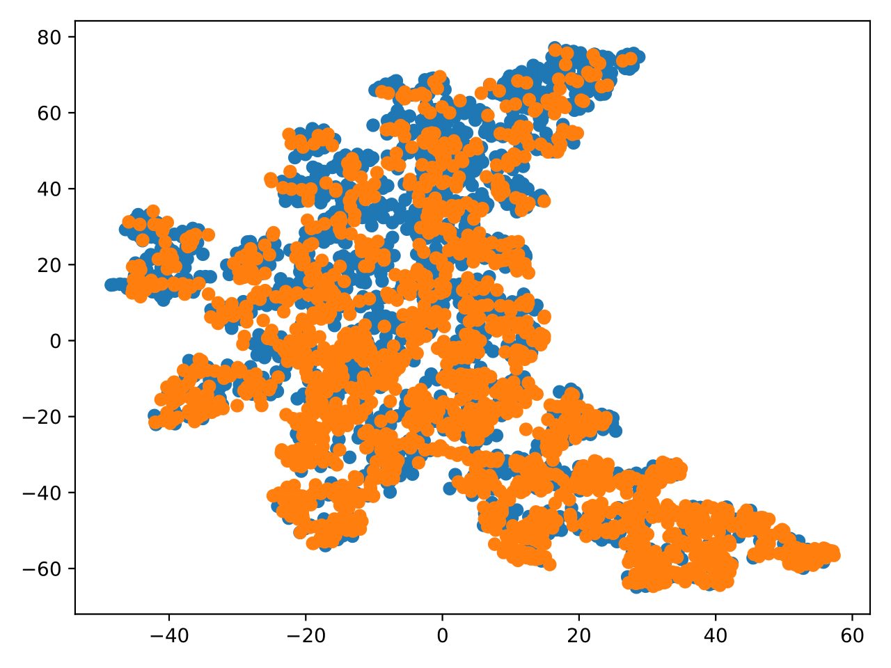
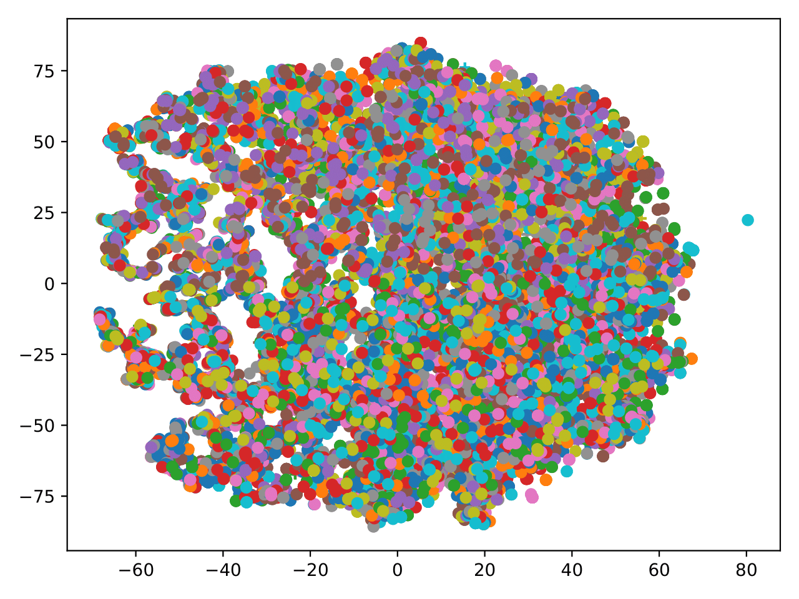

# TextGCN

## In this folder you will find: 
All files, which are needed to run the framework, will be downloaded with the commands, stated in the following sections. 


# A. General Information
- Authors
  - Liang Yao, Chengsheng Mao, Yuan Luo
- Paper: 
  - https://arxiv.org/pdf/1809.05679.pdf
- Code: 
  - https://github.com/yao8839836/text_gcn


# B. Requirements
 - Git
 - Python3.7 (tensorflow==1.14, nltk, networkx, scipy, sklearn)

Perhaps you have to add the following repo to be able to install Python3.7:
```bash
$ sudo add-apt-repository ppa:deadsnakes/ppa
```


# C. Installation
```bash
# Inside the /data-science-frameworks/TextGCN/ folder
$ git clone https://github.com/yao8839836/text_gcn.git
$ virtualenv --python=python3.7 TextGCN-venv
$ source TextGCN-venv/bin/activate
$ pip3.7 install tensorflow==1.15 nltk networkx scipy sklearn
$ deactivate
```


# D. Data
Example data is already included in the frameworks Git-Repository
Following datasets are available: 
- 20ng 
- R8 
- R52 
- ohsumed 
- mr


# E. Usage Example
```bash
# Inside the /data-science-frameworks/TextGCN/ folder
$ source TextGCN-venv/bin/activate

$ cd text_gcn/
$ python3.7 remove_words.py mr
$ python3.7 build_graph.py mr
$ python3.7 train.py mr

$ deactivate
```

Instead of `mr` you may also try to use `20ng`, `R8`, `R52`, or `ohsumed`. They represent all different datasets, which are described in the paper. 


# F. Visualization
To use the visualization tool you need to install matplotlib: 


```bash
$ source TextGCN-venv/bin/activate
$ pip3.7 install matplotlib
$ deactivate
```

You should replace line 7, 11, and 34 in file `text_gcn/visualize.py` with the name of your processed dataset: 

```python
# text_gcn/visualize.py
7: f = open('data/<DATASET>_shuffle.txt', 'r')

11: f = open('data/<DATASET>_doc_vectors.txt', 'r')

34: pdf = PdfPages('<DATASET>.pdf')
```

You should also replace line X and Y in file `text_gcn/visualize_words.py` with the name of your processed dataset: 

```python
# text_gcn/visualize_words.py
6: f = open('data/<DATASET>_word_vectors.txt', 'r')

29: pdf = PdfPages('<DATASET>_words.pdf')
```

Now you can run the following commands: 
```bash
$ source TextGCN-venv/bin/activate

$ cd text_gcn/
$ python3.7 visualize.py
$ python3.7 visualize_words.py

$ deactivate
```

## Pictures:
mr:


mr_words:

